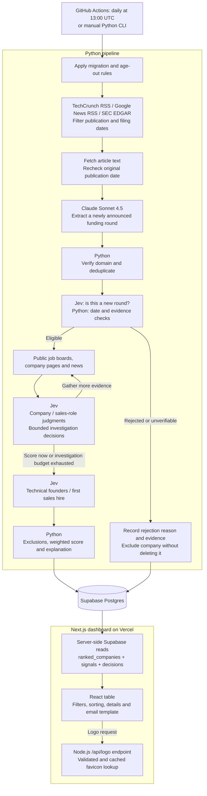

# Raised

Raised discovers recently funded companies, looks for signs that they are building
a sales function, and ranks them for outreach. The dashboard shows the top 25 by
default, with filters, a full-list toggle, source evidence, score breakdowns,
investigation history, and copyable email drafts.

**Claude extracts. Jev judges. Python scores. Supabase stores. Next.js displays.**

[Dashboard](https://raised-lac.vercel.app)

[Architecture](#architecture) · [Models](#models-used-and-what-each-does) ·
[Setup](#setup) · [Commands](#pipeline-commands) ·
[Deployment](#deployment-and-daily-scheduling) · [Verification](#verification)

## Architecture

The Python pipeline is a batch job run by **GitHub Actions**, not by Vercel.
**Vercel hosts the Next.js dashboard and its logo endpoint.** Opening the website
reads existing database records; it does not launch the pipeline or call a model.



The diagram describes a complete `run`. Diagnostic commands can stop at earlier
stages. During investigation, code fetches evidence and Jev re-evaluates company
judgments; the pipeline does not repeatedly crawl every job board on each round.

### Stack and boundaries

| Layer | Technology | Responsibility |
|---|---|---|
| Ingestion and orchestration | Python 3.12, asyncio, httpx, feedparser, Beautiful Soup | Fetch feeds/pages, enforce windows, verify domains, deduplicate and enrich |
| Structured extraction | Anthropic SDK + Pydantic | Convert article text into validated funding fields |
| Judgment | TypeSafe Jev through `langchain-typesafe` | Typed classifications, confidence and investigation choices |
| Scoring | Plain Python | Apply configured weights, exclusions, ordering and explanation text |
| Persistence | Supabase Postgres + psycopg | Store companies, signals, scores, decisions and rejection history |
| Dashboard | Next.js 16, React 19, TypeScript, Tailwind CSS 4, Lucide | Server-render data and provide client-side table interactions |
| Hosting and automation | Vercel + GitHub Actions | Serve the web app separately from scheduled pipeline execution |

## Models used, and what each does

The configured Anthropic default is **Claude Sonnet 4.5**, model ID
**`claude-sonnet-4-5`**. The judgment backend is **TypeSafe Jev**, accessed through
`TypeSafeClassifier()`. The repository does not pin a separate Jev model/version
identifier; it uses the installed SDK's default service configuration.

| Task | Model or implementation | Input and output |
|---|---|---|
| Funding extraction | **Claude Sonnet 4.5** | Article title, publication date and cleaned text → company, candidate domain, round, USD amount, announcement date, investors and supporting quote; or `not_funding_article` |
| New-round check | **Jev** | Extracted funding evidence and the company's claimed round → whether the article announces this round rather than referring to an older one |
| Company judgments | **Jev** | Company facts and available enrichment → genuine-raise signal, startup signal, B2B/B2C/Both/Unclear, round label and ICP-fit rubric position |
| Job classification | **Jev** | Job title, department and description excerpt → sales/not-sales and AE, SDR, Head of Sales or Other |
| Founder and first-hire signals | **Jev** | About/team-page excerpt → technical-founder and first-sales-hire judgments |
| Investigation decision | **Jev** | Current company evidence → `score_now`, `check_careers`, `search_news` or `fetch_about` |
| Alternative judgment backend | **Claude Sonnet 4.5** | Answers the same judgment questions through the `LLMBackend` when explicitly selected or when Jev initialization fails |
| Final score, explanation, email draft and logos | **No model** | Python calculates scores/explanations; TypeScript builds email drafts from a fixed template; logos come from favicon retrieval |

Implementation: [extraction](pipeline/src/extract.py),
[Anthropic client](pipeline/src/llm.py), [judgment backends](pipeline/src/judge.py),
[scoring](pipeline/src/score.py), [email template](dashboard/lib/map.ts).

### Model behavior

- **Extraction uses a forced `return_json` tool call** with the Pydantic
  `FundingExtraction` JSON schema, followed by Pydantic validation. It does not
  rely on parsing a free-form article summary as JSON.
- Article text is capped at **12,000 characters**. The prompt asks for only the
  round newly announced in that article, not historical rounds or cumulative
  funding. An unstated announcement date falls back to the article's publication
  date, never today's date or a page-modification date.
- Jev receives extracted fields and supporting evidence, plus bounded job,
  about/careers and news excerpts where applicable. It does not receive the full
  raw funding article.
- Jev's `Noul` answers are converted into yes/no plus confidence in the predicted
  side. `Choice` supplies categorical answers; `Score` supplies the ICP rubric
  position. Answers below **0.7** are flagged `needs_review`.
- `ANTHROPIC_MODEL` overrides the Anthropic model for extraction and LLM judgments.
  `JUDGE_BACKEND=jev|llm` selects the judgment backend. With no non-empty override,
  Jev is selected when `TYPESAFE_API_KEY` exists; otherwise the LLM backend is used.
- Jev-to-LLM fallback happens **during backend initialization**, not automatically
  for every failed Jev API request. LLM judgments use requested JSON text output,
  unlike the schema-backed extraction tool call. Model-service failures can fail
  the run; invalid extracted records are logged and skipped.

## Pipeline flow and data sources

1. **Prepare:** `run` applies the date-window migration/settings and excludes
   companies that have aged out before starting discovery.
2. **Discover:** read TechCrunch venture/startups RSS, Google News searches for
   `raises Seed`, `raises Series A` and `raises Series B`, and SEC EDGAR Form D
   full-text search. Filter feed dates before fetching article pages. Google News
   redirect URLs are decoded with `googlenewsdecoder`.
3. **Extract:** fetch article/filing text, prefer a recoverable original publisher
   date over the feed date, recheck the window, and call Claude for funding fields.
4. **Establish identity:** choose article-backed domain candidates and check the
   homepage for the company name. Unverified domains are cleared and flagged.
   Deduplicate URLs, then verified domains/normalized names, then known database
   records.
5. **Screen:** ask the new-round question and apply deterministic date/evidence
   rejection rules before job-board enrichment.
6. **Enrich and judge:** guess job-board slugs from the domain/name and try
   **Ashby → Greenhouse → Lever** for each candidate, stopping at the first
   non-empty job list. Jev judges the company and each job.
7. **Investigate:** prefetch `/about`, `/team`, `/about-us` or `/company`; let Jev
   decide whether to score or gather more evidence. Career checks try `/careers`
   and `/jobs`; news enrichment uses the daily ingest window. About evidence is
   normally already present when actions are selected. At most **3 enrichment
   rounds** run; a further forced-stop decision may be logged if the budget is
   exhausted. Founder/first-hire judgments run after enrichment.
8. **Rank and persist:** Python applies scoring exclusions and weights, then `run`
   writes eligible scores, signals, decisions and rejection snapshots to Postgres.

### Freshness windows

All executable window definitions are in
[`pipeline/src/config.py`](pipeline/src/config.py).

| Setting | Default | Purpose |
|---|---:|---|
| `INGEST_WINDOW_DAYS` | 3 | Daily article lookback |
| `DISPLAY_WINDOW_DAYS` | 90 | Dashboard retention from the raise date |
| `BACKFILL_WINDOW_DAYS` | 30 | One-time seed lookback |
| `MAX_ARTICLE_LAG_DAYS` | 7 | Maximum gap between the raise and later article publication |

RSS admission uses UTC publication timestamps. Missing publication dates, dates
outside the window and future-dated feed entries are skipped; an `updated` date
is not substituted for `pubDate`. Google searches use `when:3d` normally and
`when:30d` during backfill. EDGAR receives the corresponding filing-date range.
Per-source fetched, too-old, missing-date and retained counts are logged.

### Rejection, quarantine and age-out

| Condition | Result |
|---|---|
| Raise is older than the display window, more than the allowed lag before its article, or future-dated | Reject as `stale`, with a specific detail |
| New-round answer is no with confidence at least 0.7 and no review flag | Reject as `not_new_round` |
| Raise date, article publication date or funding evidence is unavailable; or article date is in the future | Quarantine as `source_unverifiable` |
| New-round judgment is uncertain | Keep the review flag; the record can continue if independent date/evidence checks pass |
| Stored company passes the display-window cutoff on a later run | Set `excluded = true`, `excluded_reason = "aged out"` |

Rejections are saved in `rejected_companies` with dates, reasons and snapshots.
The corresponding company rows are retained and excluded, **not deleted**.
An old record can have `stale` in its rejection history and `aged out` as its
current company exclusion reason.

`cleanup` re-fetches existing companies' saved sources, recovers publication
metadata where possible, re-extracts funding evidence and runs the new-round
judgment. It can correct an announcement date for a matching company/round,
retaining the previous date in the evidence JSON. It does **not** recompute
existing scores. Missing historical dates are not fabricated.

## Scoring

Scoring is additive, not a probability or percentage. With the current settings,
the maximum is **120 points**. Values live in `SCORING_WEIGHTS` and the related
recency/ICP constants in [config](pipeline/src/config.py).

| Rule | Points |
|---|---:|
| Raise recency | 0–30, declining linearly over the 90-day window |
| Seed, Series A or Series B | +15 |
| First-sales-hire signal **and** an open sales-role signal | +30 |
| Any open sales-role signal | +15 |
| Technical-founder signal | +10 |
| Latest ICP-fit rubric position | 0–20, normalized from Jev's 0–4 scale |

Recency is `max(0, round(30 * (1 - days_since_raise / 90)))` for known,
non-future dates. ICP points are `round(20 * clamp(raw_icp / 4, 0, 1))`.
These describe the current configured values, not separate scoring parameters.
`RECENCY_WINDOW_DAYS` follows `DISPLAY_WINDOW_DAYS`.

The pipeline sorts by score descending, then raise age ascending, then average
signal confidence descending. It saves the rules that fired and a code-generated
explanation. The dashboard initially sorts stored results by score descending.

Additional scoring exclusions hide confidently B2C companies (confidence at
least 0.7), and companies labeled `later` with more than **$200 million** raised.
Those exclusions retain company/score records. Low-confidence findings are
visible for review; confidence does not universally reduce every awarded point.

## Storage and dashboard behavior

| Table/view | What it holds |
|---|---|
| `companies` | Identity, verified-domain flag, round, amount, raise date, article publication date, source URL/title, funding evidence and exclusion state |
| `signals` | Append-only judgments, confidence, review flags, source URLs and detection timestamps |
| `scores` | Score, explanation and fired rules; unique per company and `run_date` |
| `decisions` | Investigation questions, actions, confidence and round numbers |
| `rejected_companies` | Rejection/quarantine history, company/evidence JSON snapshots and dates |
| `pipeline_settings` | Configured display window and one-time backfill completion/count |
| `ranked_companies` | Each company's most recent score across runs, filtered for display |

The ranking view excludes flagged companies, raises outside the display window,
future raises, and missing/future article publication dates. It is **not limited
to the latest pipeline run**. `migrate` initializes the settings row that the view
joins and synchronizes its display window with Python configuration.

The Next.js page performs server-side, paginated Supabase reads of
`ranked_companies`, `signals` and `decisions`. Table filtering, sorting,
expansion and clipboard interactions run in the browser. Email drafts are fixed
TypeScript templates, not generated by Claude or Jev; there is no email-sending
integration.

Verified-domain logos try the same-origin **`/api/logo`** endpoint, then the
company's `/favicon.ico`, then initials. The Node.js endpoint retrieves Google
favicons, validates responses, rejects the known generic placeholder and sends
CDN cache headers. Unknown/unverified domains use initials without a logo request.
The active logo renderer does not use Clearbit.

## Repository map

```text
pipeline/
  run_pipeline                   CLI wrapper
  requirements.txt               Python dependencies
  schema.sql                     Initial database schema and read policies
  migrations/001_date_windows.sql Additive freshness migration
  src/
    config.py                    Models, windows, weights and fetch settings
    feeds.py / fetch.py           Source filtering, HTTP and HTML extraction
    extract.py / llm.py           Claude extraction and Anthropic client
    domains.py / jobs.py          Domain verification and job-board discovery
    judge.py / investigate.py     Jev/LLM judgments and bounded enrichment
    dates.py / cleanup.py         Date validation and historical-data audit
    score.py / db.py / main.py    Ranking, persistence and orchestration
    models.py                    Shared Pydantic records
  tests/                         Unit and opt-in PostgreSQL tests
  reports/freshness_audit.json    Dated cleanup/backfill audit snapshot

dashboard/
  app/page.tsx                   Dynamic server-rendered dashboard
  app/api/logo/route.ts           Cached logo endpoint
  components/CompanyTable.tsx    Interactive table and expanded details
  components/CompanyLogo.tsx     Image loading and fallback states
  lib/data.ts / map.ts           Supabase reads and display mapping/templates
  lib/types.ts / format.ts       UI types and formatting
  lib/sample-data.ts             Explicit sample-mode data
  tests/                        Playwright browser and logo-route tests
  playwright.config.ts          Production-build and deployed-site test modes

.github/workflows/
  daily.yml                     Daily Python pipeline and date-rule tests
  dashboard.yml                 Dashboard regression and post-deployment checks
```

## Setup

Use **Python 3.12** and **Node.js 22 or newer**. CI uses Python 3.12 and Node 22;
the Supabase JavaScript packages require Node 22+. A Supabase Postgres project,
an Anthropic API key and a TypeSafe key are needed for the normal Jev-backed run.

### Pipeline

From the repository root, on a new checkout:

```bash
python3.12 -m venv .venv
.venv/bin/pip install -r pipeline/requirements.txt
cd pipeline
test -f .env || cp .env.example .env
```

Fill in `pipeline/.env`. Do not commit credentials.

| Variable | Used for |
|---|---|
| `DATABASE_URL` | Postgres connection with the permissions needed for migrations and pipeline writes |
| `ANTHROPIC_API_KEY` | Claude extraction and, when selected, LLM judgments |
| `TYPESAFE_API_KEY` | Jev judgments |
| `ANTHROPIC_MODEL` | Optional Anthropic override; default `claude-sonnet-4-5` |
| `JUDGE_BACKEND` | Optional `jev` or `llm`; defaults according to TypeSafe-key availability |
| `EDGAR_USER_AGENT` | SEC request identification; supply a real application/contact value |

For a **new database**, run [`pipeline/schema.sql`](pipeline/schema.sql) in the
Supabase SQL editor, then initialize settings/migrations from `pipeline/`:

```bash
../.venv/bin/python run_pipeline migrate
```

The migration expects the base tables to exist; it is not a replacement for the
initial schema. If using `psql` instead of the SQL editor, export `DATABASE_URL`
in your shell first: Python's dotenv loading does not export it to the shell.

For an **existing database**, use `migrate`, not a fresh-schema reset. `run` and
`cleanup` also apply the migration automatically. Legacy rows without publication
dates are hidden by the updated view until validated or quarantined by `cleanup`.

### Pipeline commands

Run these from `pipeline/`. `../.venv/bin/python run_pipeline` and
`../.venv/bin/python -m src.main` are equivalent entry points; omitting the command
means `run`.

| Command suffix | Behavior | Database writes |
|---|---|---|
| `discover` | Date-filter feeds, fetch/extract, verify domains and deduplicate; print candidates | No |
| `jobs` | Add new-round/date screening and job-board probing | No |
| `judge` | Add company/job judgments and about-page founder judgments | No |
| `score` | Add investigation and scoring; print ranking/rejections | No |
| `run` | Complete daily ingest, age-out, scoring and persistence | Yes |
| `run --backfill` or `--backfill` | Complete ingest using the one-time backfill window | Yes |
| `cleanup` | Re-audit stored companies and persist dates, new-round signals and rejections, without replacing scores | Yes |
| `migrate` | Apply additive migration and synchronize display-window settings | Schema/settings |
| `ranked` | Print the latest `run_date` batch from `scores`, not the dashboard view | No |

For a new database's initial seed, run **once**:

```bash
../.venv/bin/python run_pipeline --backfill
```

A completed backfill is recorded in `pipeline_settings`; another attempt is
refused. Its completion flag is committed with the results, so a run that aborts
before persistence does not consume the one-time seed. Backfill does not replace
existing companies that normal dedupe would skip. Do not run it from cron.

Normal daily execution:

```bash
../.venv/bin/python run_pipeline run
```

For historical cleanup, deliberately run `../.venv/bin/python run_pipeline cleanup`.
It calls models and changes stored evidence/exclusions; it is not a read-only
preview. Diagnostic stages can also incur model/API usage even though they do not
persist results.

`--mock-models` stubs funding extraction and judgments for diagnostic commands.
It is rejected for `run` and `cleanup`. It does **not** disable all I/O: database
dedupe can still read configured records and later stages still probe job boards.
Use `discover --mock-models` for a minimal model-free plumbing check. Add `-v` for
verbose logging.

### Dashboard

From the repository root:

```bash
cd dashboard
npm ci
test -f .env.local || cp .env.local.example .env.local
npm run dev
```

Set `SUPABASE_URL` and `SUPABASE_ANON_KEY` in `dashboard/.env.local`. These are read
on the server without a `NEXT_PUBLIC_` prefix. The dashboard does not need model
API keys or the pipeline's write-capable database connection string.

The schema grants anonymous read access to the dashboard tables/view. This app
does not implement a sign-in system or per-user data isolation.

For a production build, from `dashboard/`:

```bash
npm run build
npm run start
```

## Deployment and daily scheduling

### Vercel

- Use **`dashboard/` as the project Root Directory** and the Next.js framework.
- Configure `SUPABASE_URL` and `SUPABASE_ANON_KEY` for **Production**. Configure
  **Preview** separately if preview deployments should read a database too.
- Missing either variable, or a caught database-query failure, makes the page
  show bundled data labeled **Sample data**. An empty successful query is an empty
  real ranking, not sample mode. Check Vercel server logs for query errors.
- Committing locally does not update the deployed website. Publish the commit to
  the appropriate connected branch and complete the deployment.

### GitHub Actions

[The daily workflow](.github/workflows/daily.yml) runs at **13:00 UTC every day**:
**8:00 AM EST / 9:00 AM EDT**. GitHub schedules can be delayed. `workflow_dispatch`
also permits a manual run.

Configure repository secrets `ANTHROPIC_API_KEY`, `TYPESAFE_API_KEY` and
`DATABASE_URL`. Repository variables `EDGAR_USER_AGENT` and `JUDGE_BACKEND` are
passed to the job; set a valid SEC contact value and normally choose `jev`.
The workflow does not currently pass an `ANTHROPIC_MODEL` variable, so it uses
the code default unless the workflow's environment mapping is changed.

The job installs dependencies, runs pipeline unit tests, then executes
`python -m src.main run -v` using the **daily** ingest window. It never passes
`--backfill`. Scheduled workflows use the repository's default branch, so changes
must reach that branch to change daily behavior; a Vercel preview alone does not
update the scheduled pipeline.

[The dashboard workflow](.github/workflows/dashboard.yml) runs production-build
regression tests for relevant pushes to `main` and pull requests. After successful
`Production` deployments, it checks the configured public dashboard URL. That
post-deployment check requires logos for saved-domain companies and can fail when
an external logo is unavailable even if the initials fallback works correctly.

## Verification

From `pipeline/`, run tests without loading local credentials:

```bash
PYTHON_DOTENV_DISABLED=1 ../.venv/bin/python -B -m unittest discover -s tests -v
```

Database integration tests are skipped unless explicitly enabled. Prefer a test
database with the base schema and permission to create temporary tables. These
tests use temporary copies and roll back their transactions:

```bash
RUN_DATABASE_TESTS=1 ../.venv/bin/python -B -m unittest discover -s tests -v
```

From `dashboard/`:

```bash
npx tsc --noEmit --incremental false
npm run build
npx playwright install chromium
npm test
```

`npm test` builds and starts an isolated production-mode server on **port 3100**,
with Supabase variables blanked for sample data. It tests dashboard interactions,
responsive alignment, image fallbacks and the logo endpoint. Keep that port free.
The test server's sample mode does not modify production records or your env files.

To check the deployed site without starting a local server:

```bash
PLAYWRIGHT_BASE_URL=https://raised-lac.vercel.app npm test
```

To check dashboard behavior separately from strict logo-completeness checks:

```bash
PLAYWRIGHT_BASE_URL=https://raised-lac.vercel.app npm test -- dashboard.spec.ts
```

Live checks require access to the target deployment; protected Vercel previews
may require authentication.

## Current limitations and operational notes

- **Discovery is not a full daily refresh of every company.** Known dedupe keys
  and normalized names are skipped, including excluded records. Existing hiring
  signals and stored recency points are not automatically refreshed each day,
  although date-based visibility and age-out rules still apply.
- **Source coverage is bounded.** RSS feeds expose limited entries, EDGAR search
  currently reads one results page, and publishers/SEC archive pages can block
  fetching. A lookback window does not guarantee a complete historical archive.
- **Some judgments are signals, not enforced gates.** Negative `genuine_raise`
  and `is_startup` judgments are currently recorded/logged but do not themselves
  remove a company. The enforced gates are the freshness/new-round/evidence and
  scoring exclusions described above.
- **Judgments are not independently verified facts.** Board-slug matching and
  first-sales-hire inference are heuristics. Review low-confidence findings and
  original sources before outreach.
- **Dashboard and CLI rankings differ.** `ranked` reads only the newest score
  batch and does not apply the view's exclusions. The web dashboard uses each
  company's latest score across batches and applies the view's date/exclusion
  filters. The UI also labels unknown rounds as `Later`.
- **A score is not a percentage.** Numeric scores can reach 120; the current UI
  caps the score-bar fill at 100.
- **Updated is not a cron heartbeat.** The header uses the latest signal detection
  timestamp, not the last successful pipeline execution. Check Actions logs for
  scheduled-run health.
- **Audit counts are historical snapshots.** The dated
  [freshness audit](pipeline/reports/freshness_audit.json) contains the cleanup
  removal list, backfill results and acceptance checklist. It is not a live count
  of companies or a live deployment-status record.
