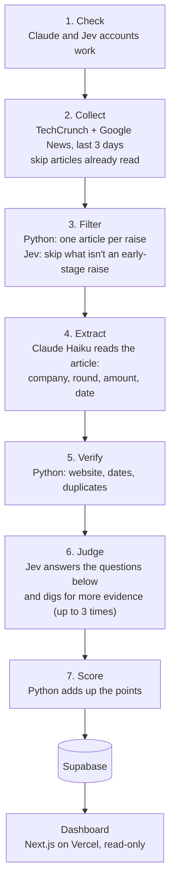

# Raised

Finds startups that just raised a pre-seed to Series B round and look ready to
build a sales team, and ranks them for outreach.

**[Open the dashboard →](https://raised-lac.vercel.app)**

> **Claude extracts. Jev judges. Python scores. Supabase stores. Next.js displays.**

## How it works

Every day at 13:00 UTC, GitHub Actions runs the pipeline once:

```mermaid
flowchart TD
    A["1. Check<br/>Claude and Jev accounts work"] --> B
    B["2. Collect<br/>TechCrunch + Google News, last 3 days<br/>skip articles already read"] --> C
    C["3. Filter<br/>Python: one article per raise<br/>Jev: skip what isn't an early-stage raise"] --> D
    D["4. Extract<br/>Claude Haiku reads the article:<br/>company, round, amount, date"] --> E
    E["5. Verify<br/>Python: website, dates, duplicates"] --> F
    F["6. Judge<br/>Jev answers the questions below<br/>and digs for more evidence (up to 3 times)"] --> G
    G["7. Score<br/>Python adds up the points"] --> H
    H[("Supabase")] --> I["Dashboard<br/>Next.js on Vercel, read-only"]
```

- If Claude or Jev is out of funds, the run stops at step 1 and saves nothing.
- Each article is paid for once, and about half never reach Claude (step 3).
- The dashboard only reads the database. It never runs the pipeline or calls a model.

## How Jev is used

Jev makes every judgment call. Claude only reads articles; Python only does
rules and math. Jev answers three kinds of question: **yes/no** (Noul),
**pick a label** (Choice) and **a 0–4 rating** (Score), each with a confidence.

| When | Jev answers | What happens |
|---|---|---|
| Before Claude | Is this headline a new pre-seed–Series B raise? | 80%+ sure it isn't → Claude never reads it |
| After Claude | Is this a **new** round, not an old one? | Sure it isn't → rejected |
| Each company | Real company raising money? A tech startup? | Sure it isn't → rejected |
| Each company | Sells to businesses, consumers, both? | Sure it's consumers → hidden |
| Each company | Which round? | Seed–Series B → +15 points |
| Each company | How well does it fit: B2B, Seed–B, building sales? (0–4) | Up to +20 points |
| Each sales-looking job | Is it a real sales role (AE, SDR, sales leader)? | Any → +15 points |
| About page | Are the founders technical? | Yes → +10 points |
| About page | Is this their first sales hire? | Yes, with a sales role open → +30 points |
| Investigation | Enough evidence, or check careers / news / about page? | Gathers it and asks the company questions again |

- **"Sure"** means 70%+ confidence. Less sure answers are kept and flagged
  "needs review" on the dashboard (the bar is 40% for fit and 50% for who it
  sells to, since those have more possible answers).
- First sales hire and technical founders earn fewer points below 70% confidence.
- An "unknown" answer (the page doesn't say) earns nothing and isn't flagged.

## Scoring (max 120)

Recency 0–30 · Seed–Series B +15 · Open sales role +15 · First sales hire +30 ·
Technical founders +10 · Fit 0–20

Hidden but kept in the database: consumer companies, late rounds over $200M,
articles that aren't a new round, non-startups, and raises older than 90 days.

## Running it

- **Daily pipeline:** [`daily.yml`](.github/workflows/daily.yml). Run it now
  from the Actions tab ("Run workflow") or with `gh workflow run daily.yml`.
  Secrets: `ANTHROPIC_API_KEY`, `TYPESAFE_API_KEY`, `DATABASE_URL` (Supabase's
  **Session pooler** URL; GitHub can't reach the direct one).
- **Locally**, from `pipeline/` with the same keys in `.env`:
  `python -m src.main run` (everything, saves) or `discover` / `score` (preview,
  saves nothing).
- **Dashboard:** Vercel, root directory `dashboard/`, with `SUPABASE_URL` and
  `SUPABASE_ANON_KEY`.
- **Tests:** `python -m unittest discover -s tests` in `pipeline/`; `npm test`
  in `dashboard/`.
