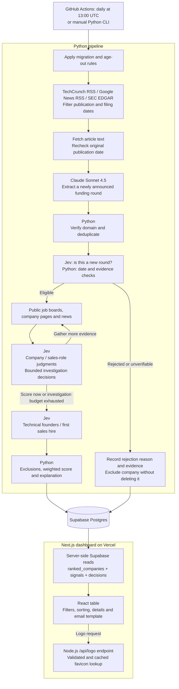

# How Raised works

Detailed reference for the pipeline, models, date rules, scoring and storage.
For setup, see the [README](../README.md).

- [Architecture](#architecture)
- [Models](#models)
- [Pipeline stages](#pipeline-stages)
- [Date windows](#date-windows)
- [Rejection and age-out](#rejection-and-age-out)
- [Scoring](#scoring)
- [Database](#database)
- [Dashboard](#dashboard)

---

## Architecture

The diagram shows a full `run`. Diagnostic commands stop at earlier stages.

| Layer | Technology | Responsibility |
|---|---|---|
| Ingestion | Python 3.12, asyncio, httpx, feedparser, Beautiful Soup | Fetch feeds/pages, enforce windows, verify domains, dedupe, enrich |
| Extraction | Anthropic SDK + Pydantic | Turn article text into validated funding fields |
| Judgment | TypeSafe Jev via `langchain-typesafe` | Typed classifications, confidence and investigation choices |
| Scoring | Plain Python | Weights, exclusions, ordering and explanation text |
| Storage | Supabase Postgres + psycopg | Companies, signals, scores, decisions, rejections |
| Dashboard | Next.js 16, React 19, TypeScript, Tailwind 4, Lucide | Server-rendered data, client-side table |
| Hosting | Vercel + GitHub Actions | Web app and scheduled pipeline run separately |

---

## Models

The default Anthropic model is **Claude Sonnet 4.5** (`claude-sonnet-4-5`).
Judgments use **TypeSafe Jev** via `TypeSafeClassifier()`, with the installed
SDK's default service configuration (no separate Jev version is pinned).

| Task | Model | Input → output |
|---|---|---|
| Funding extraction | Claude | Article title, date and text → company, domain, round, USD amount, announcement date, investors, supporting quote (or `not_funding_article`) |
| New-round check | Jev | Funding evidence + claimed round → is this a new round, not an older one? |
| Company judgments | Jev | Company facts + enrichment → genuine raise, startup, B2B/B2C/Both/Unclear, round label, ICP fit |
| Job classification | Jev | Job title, department, description → sales or not; AE, SDR, Head of Sales or Other |
| Founder / first hire | Jev | About/team page → technical founder, first sales hire |
| Investigation | Jev | Current evidence → `score_now`, `check_careers`, `search_news` or `fetch_about` |
| Fallback judgments | Claude | Same questions via `LLMBackend`, when selected or when Jev fails to start |
| Score, explanation, email, logos | No model | Python, a TypeScript template and favicon lookup |

Code: [extraction](../pipeline/src/extract.py) ·
[Anthropic client](../pipeline/src/llm.py) · [judges](../pipeline/src/judge.py) ·
[scoring](../pipeline/src/score.py) · [email template](../dashboard/lib/map.ts)

### Model behavior

- **Extraction** uses a forced `return_json` tool call with the Pydantic
  `FundingExtraction` schema, then validates it.
- Article text is capped at **12,000 characters**. Only the round newly
  announced in the article is extracted. A missing announcement date falls back
  to the article's publication date — never today's date.
- **Jev** receives extracted fields plus short job, about/careers and news
  excerpts — not the full article.
- Jev `Noul` answers become yes/no plus confidence; `Choice` gives categories;
  `Score` gives the ICP position. Anything below **0.7** confidence is flagged
  `needs_review`.
- **Backend selection:** `JUDGE_BACKEND=jev|llm`. If unset, Jev is used when
  `TYPESAFE_API_KEY` exists, otherwise Claude. `ANTHROPIC_MODEL` overrides the
  Claude model.
- Fallback to Claude only happens **when the Jev backend starts up**, not on
  individual failed Jev requests.
- **Failures:** at most 8 model calls run at once. Rate limits, overloads and
  timeouts are retried with backoff. A company that still fails is skipped for
  the run; if over 25% of a stage fails, the run aborts before writing
  anything. Invalid extracted records are logged and skipped.

---

## Pipeline stages

1. **Prepare** — apply migrations/settings and age out old companies.
2. **Discover** — TechCrunch venture/startups RSS; Google News for
   `raises Seed`, `raises Series A`, `raises Series B`; SEC EDGAR Form D
   full-text search. Dates are filtered before fetching. Google News redirect
   URLs are decoded with `googlenewsdecoder`.
3. **Extract** — fetch the article, prefer the publisher's original date over
   the feed date, recheck the window, and call Claude.
4. **Identity** — pick domain candidates from the article and check the homepage
   mentions the company. Unverified domains are cleared and flagged. Dedupe by
   URL, then verified domain/normalized name, then existing database records.
5. **Screen** — new-round check plus deterministic date/evidence rules.
6. **Enrich and judge** — guess job-board slugs and try
   **Ashby → Greenhouse → Lever**, stopping at the first non-empty list. Jev
   judges the company and each job.
7. **Investigate** — prefetch `/about`, `/team`, `/about-us` or `/company`; Jev
   decides whether to score or gather more (`/careers`, `/jobs`, news). At most
   **3 enrichment rounds**. Founder/first-hire judgments run afterwards.
8. **Rank and save** — apply exclusions and weights, then write scores, signals,
   decisions and rejections to Postgres.

---

## Date windows

Defined in [`pipeline/src/config.py`](../pipeline/src/config.py).

| Setting | Default | Purpose |
|---|---:|---|
| `INGEST_WINDOW_DAYS` | 3 | Daily article lookback |
| `DISPLAY_WINDOW_DAYS` | 90 | How long a raise stays on the dashboard |
| `BACKFILL_WINDOW_DAYS` | 30 | One-time seed lookback |
| `MAX_ARTICLE_LAG_DAYS` | 7 | Max gap between the raise and the article |

- RSS uses UTC `pubDate`. Missing, out-of-window and future dates are skipped;
  `updated` is never used in its place.
- Google searches use `when:3d` (or `when:30d` for backfill). EDGAR gets the
  matching filing-date range.
- Per-source counts (fetched, too old, missing date, kept) are logged.

---

## Rejection and age-out

| Condition | Result |
|---|---|
| Raise too old, too far before its article, or in the future | Rejected as `stale` |
| Jev says "not a new round" with ≥ 0.7 confidence | Rejected as `not_new_round` |
| Jev says "not a funding raise" or "not a startup" with ≥ 0.7 confidence | Rejected as `not_startup_raise`, unless it would reject over half of a batch of 4+ (treated as a model problem and skipped) |
| Missing raise date, article date or evidence; or future article date | Quarantined as `source_unverifiable` |
| New-round answer is uncertain | Flagged for review; continues if date checks pass |
| Company passes the 90-day cutoff on a later run | `excluded = true`, reason `aged out` |

Rejections go to `rejected_companies` with snapshots. Company rows are
**excluded, never deleted**.

### `cleanup`

Re-fetches stored companies' sources, recovers publication dates, re-extracts
funding evidence and reruns the new-round check. It may correct an announcement
date (keeping the old one in the evidence JSON). It does **not** recompute
scores and never invents missing dates.

---

## Scoring

Additive points, max **120**. Values are in `SCORING_WEIGHTS` in
[config](../pipeline/src/config.py).

| Rule | Points |
|---|---:|
| Raise recency | 0–30 |
| Seed, Series A or Series B | +15 |
| First sales hire **and** an open sales role | +30 |
| Any open sales role | +15 |
| Technical founder | +10 |
| ICP fit (Jev's 0–4 scale) | 0–20 |

- Recency: `max(0, round(30 * (1 - days_since_raise / 90)))`
- ICP: `round(20 * clamp(raw_icp / 4, 0, 1))`
- Sort order: score ↓, raise age ↑, average signal confidence ↓.
- **Excluded from ranking** (but kept): B2C with ≥ 0.7 confidence, and `later`
  rounds with more than **$200M** raised.
- Low-confidence findings stay visible for review; confidence doesn't reduce
  points.

---

## Database

| Table / view | Holds |
|---|---|
| `companies` | Identity, verified-domain flag, round, amount, dates, source, evidence, exclusion state |
| `signals` | Append-only judgments with confidence, review flags and sources |
| `scores` | Score, explanation and fired rules; one per company per `run_date` |
| `decisions` | Investigation questions, actions, confidence and round numbers |
| `rejected_companies` | Rejection/quarantine history with snapshots |
| `pipeline_settings` | Display window, one-time backfill status and last successful run |
| `pipeline_status` | Read-only view of the last successful run time, for the dashboard |
| `ranked_companies` | Each company's latest score, filtered for display |

`ranked_companies` hides excluded companies, raises outside the display window,
future raises and missing/future article dates. It uses each company's **latest
score across all runs**, not just the latest run.

---

## Dashboard

- The Next.js page reads `ranked_companies`, `signals` and `decisions` on the
  server (paginated). Filtering, sorting and copying happen in the browser.
- Email drafts are a fixed TypeScript template. Nothing sends email.
- **Logos:** `/api/logo` (validated, cached Google favicon) → the company's
  `/favicon.ico` → initials. Unverified domains go straight to initials.
